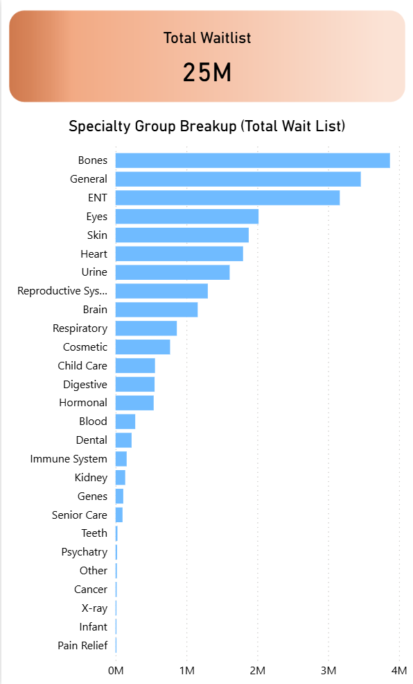

# 📊 Patient Waitlist Power BI Dashboard

This repository contains a three-page Power BI dashboard analyzing patient waitlist performance across years, specialties, age groups, and case types (Inpatient/Outpatient).

The project follows a YouTube tutorial, but all data cleaning, modeling, DAX calculations, and report design were independently implemented.

* **Dataset Source:** [Pivotal Stats - End-to-End Power BI Dashboard](https://pivotalstats.com/end-end-power-bi-dashboard-development/)
* **Tutorial Reference:** [YouTube Tutorial Link](https://youtu.be/G8ikAJele_s?si=QChlENK_G-BMdRoK)

---

## 📂 Project Structure

### Dashboard Pages
* **Summary Dashboard** – KPIs, trend lines, donut charts, bar charts.
* **Detailed View** – Matrix table and slicers for granular analysis.
* **Tooltip Page** – Custom tooltip page used for line-chart drilldowns.

### Screenshots

---

## 🧹 Data Preparation (Power Query)

The dataset was imported using the **Folder Connector**, allowing Power BI to automatically combine multiple CSV files from different years.

**Key transformation steps:**
* Corrected data types for date and numerical columns.
* Cleaned and standardized labels (fixing inconsistencies in age groups and time bands).
* Trimmed text fields to remove whitespace errors.
* Renamed and aligned column structures across files to ensure successful appending.
* Appended **Inpatient** and **Outpatient** datasets into a master table.
* Imported an additional specialty mapping table for categorization.

---

## 🧠 Data Modeling

A structured data model was created following Star Schema principles where applicable:

* **Fact Table:** Combined Inpatient/Outpatient dataset.
* **Dimension Tables:** Specialty mapping and supporting lookup tables.
* **Relationships:** Established proper 1-to-many relationships with optimized filter directions.
* **Hierarchies:** Created hierarchies for Age and Time Bands to facilitate drill-down analysis.

---

## 🔢 DAX Measures

Multiple DAX measures were created for KPIs, visuals, and dynamic tooltips, utilizing:

* **Aggregations:** `SUM`, `AVERAGE`, `MEDIAN`.
* **Context Transition:** Used `CALCULATE` for time-intelligence and specific filtering.
* **Date Logic:** `EDATE` and date offsets for Year-over-Year comparisons.
* **Conditional Logic:** `SWITCH` used for dynamic chart titles and toggling between Average and Median metrics.
* **Data Handling:** Logic to handle blanks and provide user-friendly fallback messages.

---

## 🎨 Dashboard Design

The dashboard visuals were styled using a custom theme inspired by professional design resources.

* **Adobe Stock:** Used for overall theme inspiration.
* **Adobe Color:** Used to extract a consistent color palette.
* **PowerPoint:** Used to design the canvas background, containers, and layout (imported as an image into Power BI).
* **Power BI Visuals:** Utilized Cards, Donut Charts, Stacked Bars, Line Charts, Slicers, Matrix tables, Navigation buttons, and custom Tooltips.

---

## 🧰 Tools Used

| Tool | Purpose |
| :--- | :--- |
| **Power BI Desktop** | Data modeling, DAX, visualization |
| **Power Query** | Data preparation and transformation |
| **DAX** | KPI and metric calculations |
| **Adobe Stock / Color** | Theme and color palette extraction |
| **PowerPoint** | Background and layout design |
